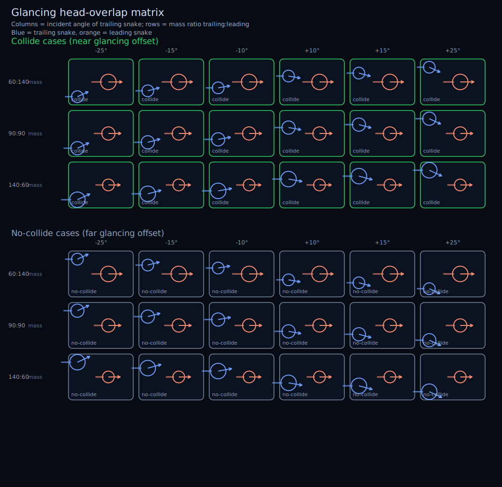

# NEON SERPENT

A single-player neon arcade snake game. Neon 2D canvas, a large scrolling world,
AI serpents, and controls that adapt to mobile or desktop.

## Run it

```bash
npm install
npm start          # Parcel dev server, hot-reload → http://localhost:1234
```

## Build & deploy

```bash
npm run build      # bundles to dist/ (relative paths, host anywhere static)
```

`dist/` is a static bundle — drop it on any static host (Netlify, Pages, S3,
nginx). The only network dependency is the Orbitron webfont from Google Fonts;
it falls back to a system sans-serif offline.

## Test

```bash
npm test           # Node's built-in runner: node --test
```

Key suites under `test/`:

- **ai-performance** — compares configured bot navigation and avoidance modes,
  printing compute cost per tick alongside death-cause metrics.
- **collision** — invariants that must never regress: self-collision is lethal
  but the neck is exempt (a full-lock turn alone can't kill), and every segment
  of another serpent — tail tip included — is lethal. Glancing head overlaps are
  checked across angle and size-ratio matrices to avoid unfair mutual kills.
- **longevity** — runs repeated seeded 10-minute bot-only simulations through
  the real update loop, reports death-cause metrics, and asserts self-collision
  stays below the regression threshold.
- **smoke** — boots the browser entry under DOM stubs and drives every input
  path (mouse, simultaneous joystick + boost, keyboard, resize, slow frames).

Tests import the simulation modules directly and run headless — no browser, no
Parcel. The simulation core is deliberately DOM-free so this stays possible.

### Glancing collision matrix examples

The grid below shows representative collide vs no-collide glancing setups over a
range of incident angles and trailing/leading mass ratios:



## Layout

```
index.html            Markup + CSS; Parcel entry. Loads src/main.js as a module.
src/
  constants.js        All balance knobs (world size, speeds, caps, counts).
  math.js             Pure helpers (angles, clamp, colour).
  food.js             Pellets + uniform-grid spatial hash.
  snake.js            Snake entity: movement, arc-length body, boost, death.
  ai.js               Bot brain + configurable hazard-avoidance modes.
  world.js            Simulation core: roster, spawn, collide, eat, update.  ← DOM-free
  view.js             Canvas, DPR sizing, adaptive resolution.               ← browser
  sprites.js          Pre-baked neon glow sprites.                           ← browser
  input.js            Mouse / touch joystick / boost button / keyboard.      ← browser
  render.js           Camera, culled world draw, minimap.                    ← browser
  main.js             Entry: state machine, fixed-timestep loop, HUD, score.  ← browser
test/
  ai-performance.test.mjs
  collision.test.mjs
  longevity.test.mjs
  smoke.test.mjs
  helpers/dom-stub.js DOM/canvas/rAF stubs for the smoke test.
```

The dividing line: `constants / math / food / snake / ai / world` are pure and
headless-testable; `view / sprites / input / render / main` touch the DOM. To
change feel, start in `constants.js`; to change rules, `world.js` and `ai.js`.
Bot AI ablations are selected with `BOT_NAV_MODE` and `BOT_AVOIDANCE_MODE` in
`constants.js`.

## Controls

- **Steer** — mouse (desktop) · right-side joystick (touch)
- **Boost** — hold click / space (desktop) · left-side button (touch); burns length
